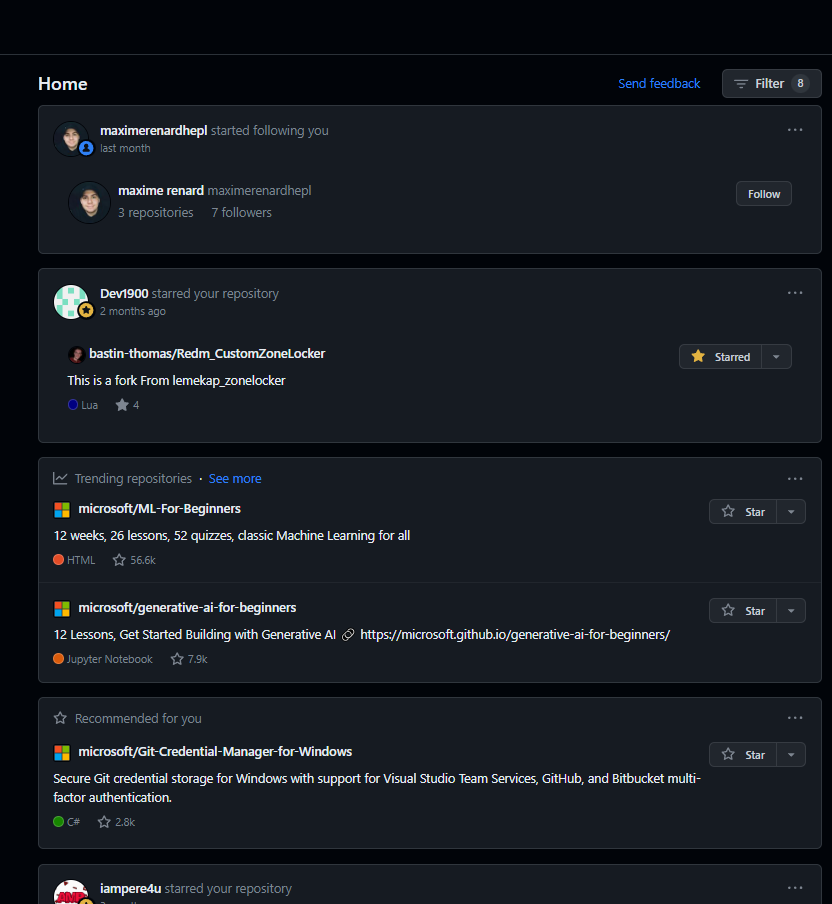
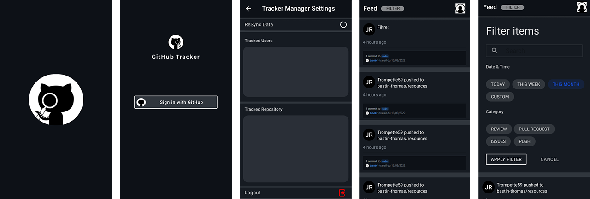
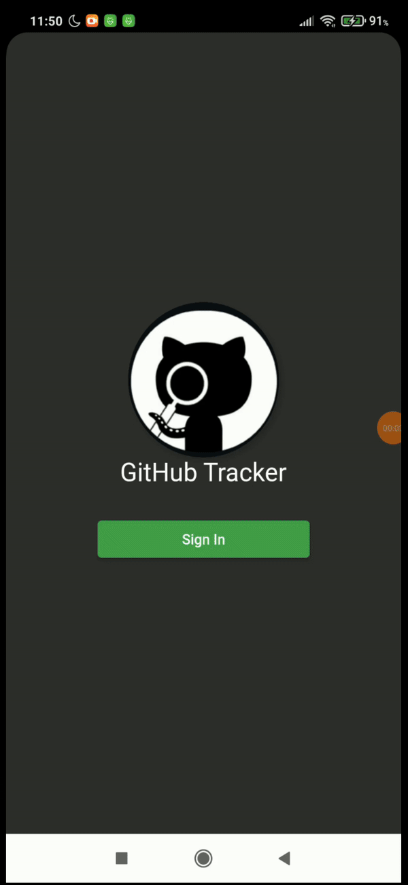
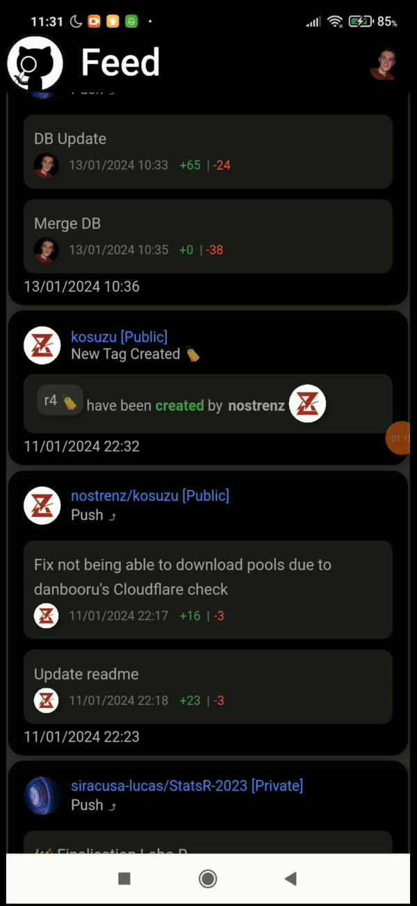

# GitHub Tracker
> Examen Flutter 2023-2024
This Tracker is of course a way to track your activity on GitHub, and also activity of wanted user.
You can also track a specific repository to have all news about it.

## 📦 | Project Installation:
[Install Flutter and Dart SDK](https://docs.flutter.dev/get-started/install/windows/mobile?tab=download#install-the-flutter-sdk)
Open ./code/git_hub_tracker/ as Flutter Project in Inteliji/AndroidStudio
Click on Run() when a phone is configured ⚠️it's an Android/IOS app, do not execute it on Web or other environment.

## 🗂️|Folders in the Repository
- **Documentation** : Gathers all informations based on documentation used for this project (rules, link to other docs...).
- **Mockup**: Gathers all Application's Mockup.
- **Source**: Guess... It contain all the App's source code. The Flutter Library is divided in 'Module', authentication, core, feeds page. That follow a sort of MVC.

## 📜| Application Description
Have you never been curious to know a little more of your Github Activity ? Or a specific Repository Activity ? Or maybe even from other users ? All from your smartphone, with one common feed ? If it's the case, so this application is made for you.

**Firstly**,  Application is able to **track** all your **Github profile's** **activity** in one **Feed**. It will track your *commits*, *merges*, *issues*, *pull request*... made on all repository you have or contribute (Private or Public).
You could also track multiple Public Repository Activity. Or add a list of tracked users, so all their public activity will be added in your feed.

The feed once filled could be filter based on user Choice. Like showing only commits, or issues, push, starring event. Filters could be combined also. Like showing commits **and** issues. 

By default, when a user connect for the first time, all Starred repositories will be added to the tracked repositories, and all followed users to the tracked users.

## 📱| Existing Applications
Of courses Github itself already provide this services. But they also add proposal from random repositories, or users. So my App remove this type of problem and focus only on what you want to track.

The other bad news is that the Official Github Application dont provide a list of all activity into a main feed. 

## ✨|User Stories:
- *As a user* *I want* to be able to connect using OAuth Github Authentication *to use* GitHubTracker and if it's my first connection, import all my tracks based on my Github Starred Repositories, or followed Users.
- *As a user* I can choose to reSync my tracks based on my Github Starred Repositories, or followed Users. 

- *As a user* I can add or remove public repositories to the list of tracked repositories.
- *As a user* I can add or remove github users to the list of tracked users.

- *As a user* I can filter my feed based on the type of event I want see in my feed (pull request, issues,  starred, push...).

## 💻|Mockup:

## 🎥 | Demo:
### Login Flow

### Auth Token saved in local Storage (SecureStorage)

### Tracked User List Management

### Filter and Feed Display

### Web redirection when usefull

## ♻️| Advancement

✅ ReadMe Creation

✅ Repository Folder Tree Creation

✅ Mockup Creation

✅ Login Page UI Creation

✅ Login Page Logic Creation

✅ Navigation Logic / Routing Creation

✅ Feed Page Creation

✅ Event Widget UI Creation

✅ Event Data Model Creation

✅ Client Github API Library Creation

✅ Tracked users list Addition.

✅ Tracked repositories list Addition.

✅ Data persistance using FireBase.

✅ Feed Filter Addition.
